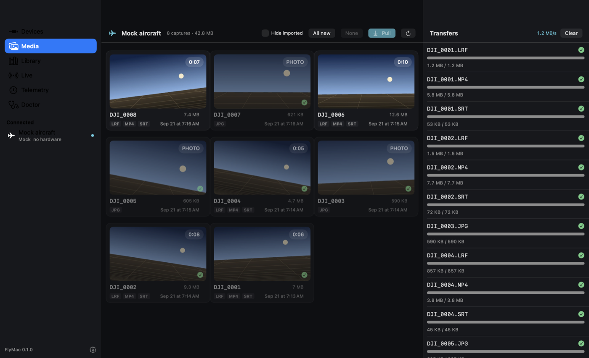
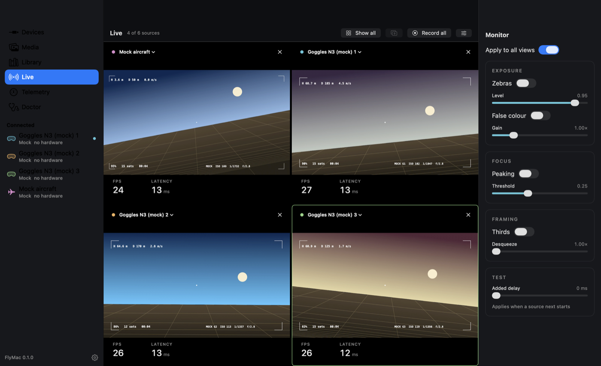

# FlyMac

A native macOS companion for DJI aircraft: Quick Transfer and wired media ingest, live video over USB, and camera/telemetry remote functions. **The Mac never flies the aircraft.** No stick, takeoff, land or RTH commands exist in this codebase; nothing here touches geofencing, Remote ID, activation or account checks.

Swift package, SwiftUI app, builds with Command Line Tools only (no Xcode needed yet).



## Honest capability matrix

Evidence levels: **confirmed** = seen working on real hardware here, with a capture on file · **mock** = works end to end against the built-in fake aircraft only · **unverified** = from public docs, never seen on hardware · **blocked** = tried and it does not work.

| Feature | Mock aircraft | Avata 2 | Goggles N3 | RC-N2 | Any UVC card |
|---|---|---|---|---|---|
| Discover over USB (VID/PID, interfaces, endpoints) | n/a | unverified | unverified | unverified | confirmed (AVFoundation) |
| Card mounts as a drive → import | mock | unverified | unverified | n/a | n/a |
| Quick Transfer over Wi-Fi (list, thumbnails, resume, hash) | mock | unverified, API not yet captured | n/a | n/a | n/a |
| Library: dated folders, LRF/SRT pairing, dedupe, SHA-256 | mock | pending Phase 0 | pending | n/a | n/a |
| DUML read-only handshake (ping / get version) | mock | unverified | unverified | unverified | n/a |
| Telemetry HUD + flight map | mock (DUML) · SRT parsing confirmed on DJI-format samples | unverified | unverified | sticks: unverified | n/a |
| Live video → Metal, latency readout, record HEVC/ProRes | mock (H.264 encode→decode) | unverified | unverified | unverified | confirmed path (UVC source) |
| Monitor tools (zebra, peaking, false colour, thirds, desqueeze) | mock | any live source | any live source | any live source | any live source |
| Several devices at once (up to 4 live views, per-device telemetry, fleet map, Record all) | mock (aircraft + up to 4 simulated goggles) | unverified | unverified, needs USB video first | unverified | confirmed path |
| Camera control | not built (Phase 4, only after Phase 0 proves it safe) | | | | |

Phase 0 discovery results live in [docs/DISCOVERY.md](docs/DISCOVERY.md); everything learned about the protocols, with sources and dated captures, in [docs/PROTOCOLS.md](docs/PROTOCOLS.md).

## Run it

```bash
tools/bundle.sh            # → build/FlyMac.app (release)
open build/FlyMac.app
```

```bash
tools/test.sh              # swift test, with the Swift Testing paths CLT needs
swift run flymac-doctor    # headless Doctor report; add --scan, --watch, --raw
```

The mock aircraft is on by default in Settings, so the whole app works with nothing plugged in. Turn it off and every trace of it leaves the screen.

## Several goggles at once

Plug in as many as you like. Identical devices get stable numbers ("Goggles N3 1", "Goggles N3 2") and a colour that follows them across every screen. The pencil on a device card names it ("Jake's goggles"); the name is remembered by serial number. Live shows up to four views in a grid, **Show all** fills it, **Record all** writes one file per view with a shared timestamp. Each device gets its own read-only telemetry link, and unplugging one never touches the others. Media pulled from two cards that both contain `DJI_0001.MP4` stays separate in the library.

To try it with no hardware: Settings → Sources → Simulation → Mock goggles (1–4).



Real Goggles N3 video over USB is still unverified (Phase 0), so on real hardware this currently applies to telemetry links, cards and UVC capture cards.

## Layout

| Module | What |
|---|---|
| `FlyCore` | Device-profile registry (USB/SSID/volume matching), capability claims with evidence, Doctor report, settings |
| `DUML` | Pure-Swift DUML v1 codec (CRC8/CRC16, framing, stream parser), read-only session with command whitelist and write log |
| `USBTransport` | IORegistry enumeration, IOUSBHost endpoint parsing, hot-plug monitor, DUML-over-bulk link |
| `QuickTransfer` | Network snapshot, TCP scanner, HTTP probe recorder, API dialects, resumable parallel downloader, hotspot watcher |
| `Ingest` | Library on disk: verified copy, LRF/SRT pairing, content dedupe |
| `Video` | Annex-B parser → VideoToolbox → Metal, UVC source, AVAssetWriter recorder |
| `Telemetry` | Common frame model, SRT parser, DUML OSD decoder |
| `MockDevice` + `Fixtures` | Synthetic flight, rendered card (MP4/LRF/SRT/JPG), HTTP server with Range, DUML pushes, H.264 stream |
| `FlyMac` | The SwiftUI app · `flymac-doctor` the CLI |

## Adding a device

Plug it in, open Doctor, press Run, and send the report (or paste it into an issue). A profile is data in `FlyCore/ProfileRegistry.swift`: VID/PID, SSID patterns, and capability claims each tagged with evidence and a source.
